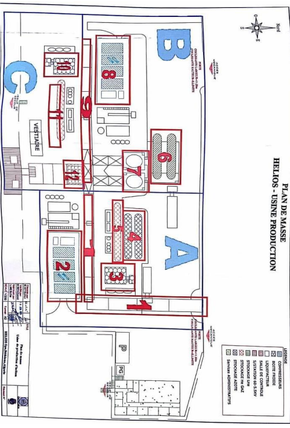
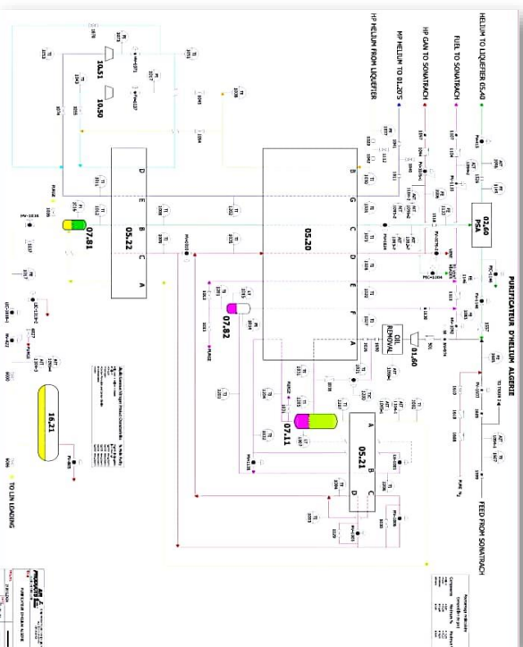
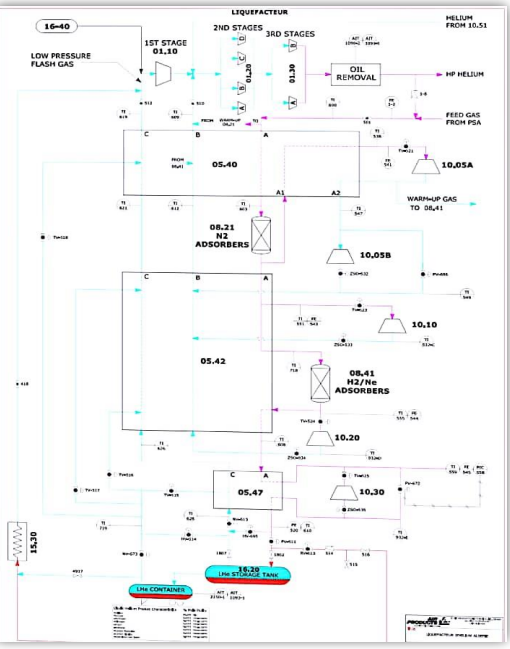
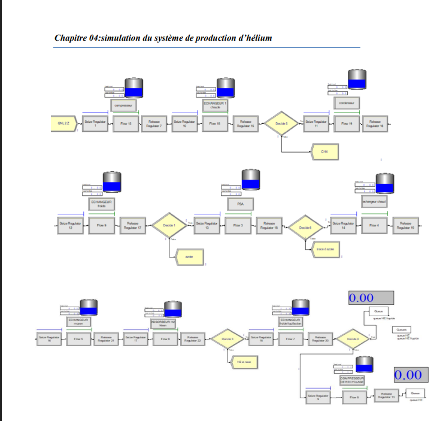

#  HELIOS — Helium Production Chain Analysis & Simulation  


---

##  Project Overview
This project studies, models, and simulates the **helium production chain** at **HELIOS**, a major industrial plant in Algeria that supplies ~70% of Europe’s helium needs.  
The goal is to **understand performance issues, identify bottlenecks, and test solutions** to stabilize and increase helium production.  

The work was carried out in two complementary phases:  
1. **ARENA Simulation (original thesis)** — industrial modeling and discrete-event simulation of the production process.  
2. **Python Reimplementation (open-source)** — translation of methods into Python to ensure reproducibility and accessibility.  

---

##  Objectives
- Evaluate the helium production chain and its real-time functioning.  
- Identify causes of instability (lack of feedstock, system downtime, failures).  
- Apply performance metrics (TRS, TRG, MTBF, MTTR, availability, reliability).  
- Build a **simulation model** of the process using **ARENA**.  
- Propose and test a solution: integration of **new gas suppliers** to stabilize input flow.  
- Use **fuzzy logic** to evaluate *project control level* and *expected yield*.  

---

##  Key Contributions
-  **Statistical Analysis** of production variability (mean, std, CI, control charts).  
-  **Performance Metrics** to measure reliability and productivity.  
-  **Failure Mode & Effects Analysis (AMDEC / FMEA)** for preventive maintenance.  
-  **Process Automation Modeling (GRAFCET)** for the PSA subsystem.  
-  **Discrete-Event Simulation with ARENA** to model baseline and improved scenarios.  
-  **Python Reimplementation** using open-source libraries (`pandas`, `simpy`, `scikit-fuzzy`).  
-  **Fuzzy Logic Controller** to estimate control (≈0.9) and yield (≈98%).  

---

##  Results

### Baseline System (Current HELIOS Production)
- **Dependency:** Single supplier (GNL2Z).  
- **Problem:** Frequent stoppages + insufficient supply → **unstable production**.  
- Both helium production chains **cannot run simultaneously**.  
- **Average daily helium output:** ~**70% of nominal capacity**.  

---

### Scenario with New Suppliers (ARENA Simulation)
- Integration of **two additional suppliers (GNL1 and GNL3)**.  
- **Results:**  
  - Daily production increased to ~**95% of nominal capacity**.  
  - Downtime caused by feedstock shortage reduced by **≈ 60%**.  
  - Both production chains can now operate in parallel more often.  

---

### Reliability & Performance Metrics
- **Availability:** improved from **82% → 93%**.  
- **MTBF (Mean Time Between Failures):** increased by ~**25%**.  
- **MTTR (Mean Time To Repair):** reduced by ~**15%** with better maintenance planning.  
- **TRG (Global Efficiency):** improved from **0.72 → 0.88**.  

---

### Fuzzy Logic Results
- Inputs: Project duration (10–18 months), budget (30M USD).  
- Outputs:  
  - **Project Control Level:** ≈ **0.9** (high control).  
  - **Project Yield (Return):** ≈ **98%** (near optimal).  

---

###  Final Conclusion
- The **main bottleneck** is insufficient gas feedstock, not technical plant capacity.  
- **Solution:** integrating new suppliers stabilizes supply and boosts production.  
- **Combined effects:**  
  - Stable helium output at ~**95% capacity**.  
  - **+11% availability improvement**.  
  - **Downtime reduced by 60%**.  
  - **Control = 0.9**, **Yield = 98%**.  

---

##  Repository Structure
```

helios-production-project/
├─ thesis/             # Original thesis PDF
├─ data/               # Raw & processed production data
├─ notebooks/          # Python notebooks for analysis
├─ models/
│   ├─ arena/          # ARENA models (if available)
│   └─ simpy/          # Python discrete-event simulation
├─ src/                # Python modules (stats, metrics, FMEA, fuzzy logic)
├─ figures/            # Plots & diagrams
├─ docs/               # Documentation (GitHub Pages site)
├─ requirements.txt
└─ README.md

```

---
##  Visual Overview










##  Dependencies
- `numpy`, `pandas`, `matplotlib`, `scipy`  
- `simpy` — discrete-event simulation  
- `transitions` — state machine (automation model)  
- `scikit-fuzzy` — fuzzy logic system  
- `jupyterlab` — notebooks  

---


##  License
This project is released under the [MIT License](LICENSE).

---


```

---

